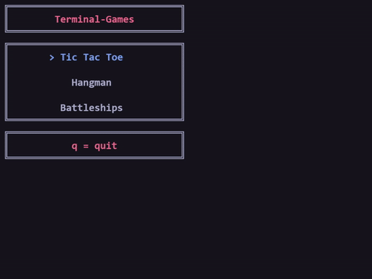
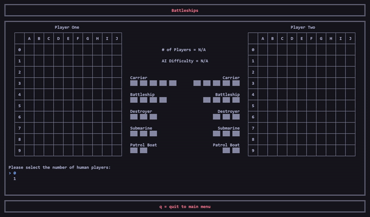

# About
Simple games that run in the terminal

# Info
* For all games:
  * 2 players = human vs human, 1 player = a human vs computer, and 0 players = computer vs computer
  * Easy AI = random command/letter/move selection by computer
* For Hangman:
  * The word to be guessed must be 3-14 characters long and contain only letters
  * Only single letter guesses allowed
  * When guessing a letter, instead of scrolling through letters using the arrow keys, pressing a letter key will skip the current selected guess to that letter (please note that pressing q here will quit the game)
* For Battleships:
  * Selecting ship positions must be done in either an incrementing or decrementing order
  * Backspace can be used to undo a ship co-ord selection, but a ship that has been already been placed cannot been undone

# Building [](https://github.com/J-Afzal/Terminal-Games/actions/workflows/cmake.yml)
Use the following CMake command in the project root directory:
```
cmake -S . -B build
```


# Warning
This program was developed and tested on the Visual Studio Terminal and Visual Studio Code Integrated Powershell Terminal on Windows 10. Due to the use of _getch(), Windows.h, and ANSI colour escape codes this program may not work in other terminal environments.

# Main Menu
<p align="center">  </p>

# Tic Tac Toe
<h3 align="center"> In Game Screenshot (left) and  Game Over Screenshot (right) </h3>
<p align="center">   </p>

# Hangman
<h3 align="center"> In Game Screenshot (left) and  Game Over Screenshot (right) </h3>
<p align="center">   </p>

# Battleships
<h3 align="center"> In Game Screenshot (left) and  Game Over Screenshot (right) </h3>
<p align="center">   </p>

# Game Gifs
<h3 align="center"> Main Menu Scrolling </h3>
<p align="center">  </p>
<h3 align="center"> Tic Tac Toe Player vs Computer (left) and Hangman Player vs Player (right) </h3>
<p align="center">   </p>
<h3 align="center"> Battleships Player vs Computer </h3>
<p align="center">  </p>
