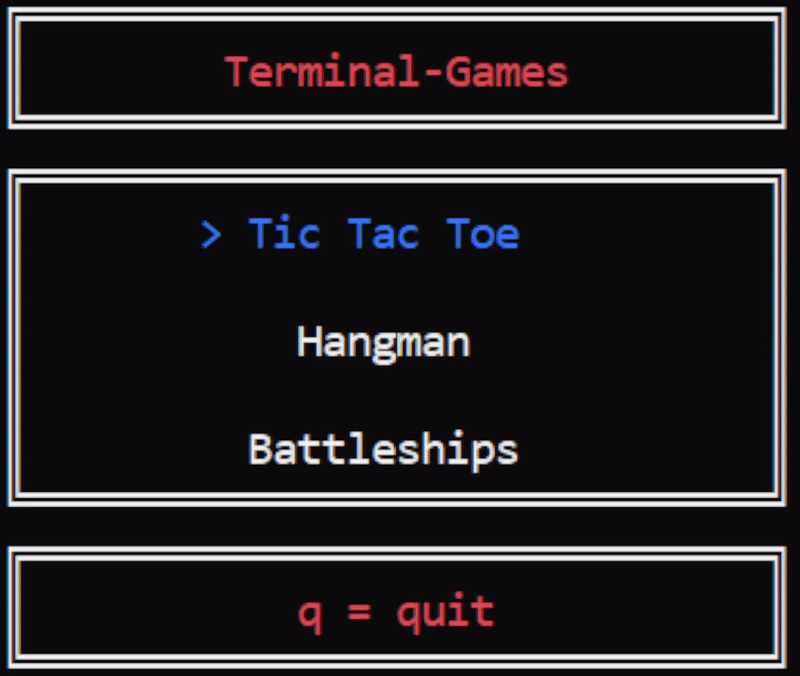

# Terminal Games

## About

Simple games that run in the terminal. The project is run by instantiating the `MainMenu` class, optionally passing a bool to enable or disable ASCII only mode, and then calling its `Run()` method.

* For all games:
  * All menus can be navigated using the arrow keys
  * 2 players = user vs user, 1 player = user vs computer, and 0 players = computer vs computer
  * AI = Random command/letter/move selection by computer
* For Hangman:
  * The word to be guessed must be 3-14 characters long and contain only letters
  * Guesses can only be a single letter at a time
  * When guessing, you can use the up/down arrow keys to scroll through the available letters or press a letter key to select it (please note that pressing q here will quit to the main menu)
* For Battleships:
  * Selecting ship positions must be done in either an incrementing or decrementing order with respect to the co-ordinates
  * Backspace can be used to undo a ship co-ordinate selection for a ship that has not been placed on the board

## Building [](https://github.com/J-Afzal/Terminal-Games/actions/workflows/cmake.yml)

Use the following CMake command in the project root directory:

```cmd
cmake -S . -B build
```

## Warning

Due to the use of `Windows.h` and ANSI colour escape codes, this project has only been tested on Windows using either the Visual Studio Terminal or the Visual Studio Code Integrated Powershell Terminal.

## Main Menu GIF



## Tic Tac Toe GIF


## Hangman GIF


## Battleships GIF


