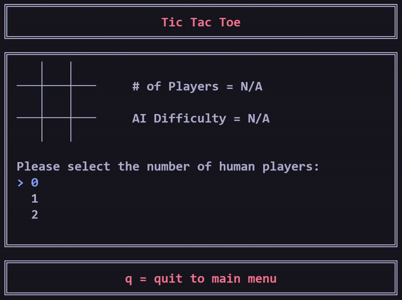
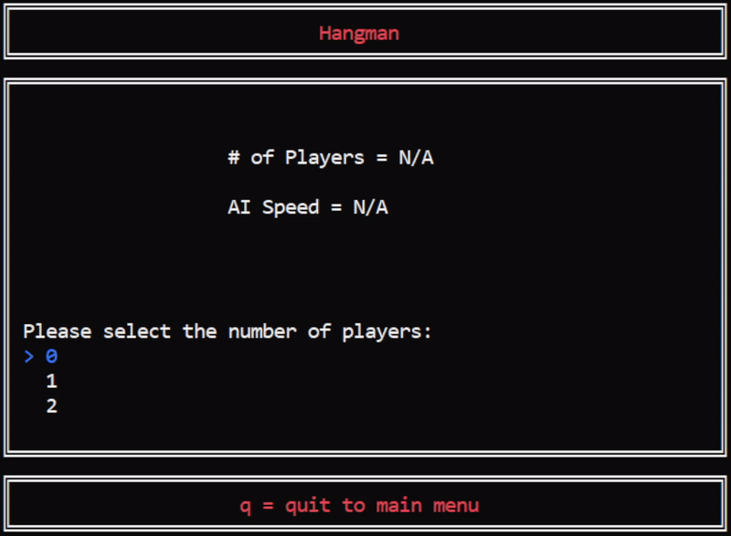
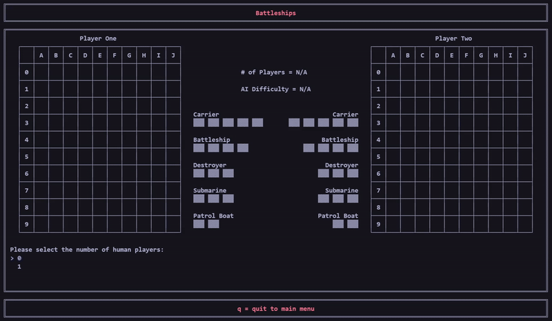

# Game List

    

# GUI Features
* Game selection as shown above and press q to quit
* Number of players selection, AI difficulty selection, player choice selection done in similar fashion as game selection
* For Tic Tac Toe and Battleships, the cursor is moved to a place on the board and can be moved using the arrow keys and a selection can be made by pressing enter
* For Hangman, the current guess is highlighted as blue and can be changed by pressing up and down arrow keys and selected by pressing enter
* For Hangman and Battleships, the cursor is moved to the appropriate location for text input to occur after the display request is made

# Tic Tac Toe
* Supports 0-2 players
    * 2 players represent human vs human
    * 1 player represents a human vs computer
    * 0 players represent computer vs computer
* AI Difficulty
    * Easy = Random next command
    * Hard = Uses Minimax algorithm

    

# Hangman
* Supports 0-2 players
  * 2 players represent human vs human
  * 1 player represents a human vs computer, with the human player deciding who is guessing
  * 0 players represent computer vs computer
* AI Difficulty
  * Easy = Random guessing and picks shorter words to guess from internal word list
  * Hard = Probabilistic guessing and picks longer words to guess from from internal word list
* The word to be guessed must be 3-14 characters long and contain no hyphens/spaces/non-letters
* No guessing the whole word is allowed (only single letter guesses allowed)

    

# Battleships
* Supports 0-1 players
    * 2 players representing human vs human is NOT supported as it is impossible to practically hide the opponent's board when using a single terminal
    * 1 player represents a human vs computer
    * 0 players represent computer vs computer
* AI Difficulty
    * Easy = Random placement of ships and random guessing of attack locations
    * Hard = Same as Easy but once a successful attack has been made the AI then continues to attack in the area until that ship is sunk

    

# Needed Improvements
* TicTacToe - Implement Hard AI to use the Minimax Algorithm as seen [here](!https://www.geeksforgeeks.org/minimax-algorithm-in-game-theory-set-1-introduction/)
* Hangman - Implement Hard AI to to use probabilistic guessing as seen [here](!https://www.datagenetics.com/blog/april12012/) and to choose longer words and implement Easy AI to choose shorter words
* Battleships - Implement Hard AI to continue to attack in a smart manner once a successful hot has been made until the ship is sunk

# Warning
This program was developed and tested on the VS Code integrated powershell terminal on Windows 10 and so may not work as shown below in other terminals due to the use of _getch(), Windows.h, and ANSI colour escape codes.