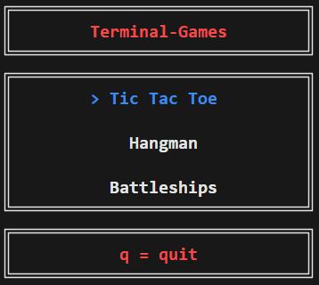
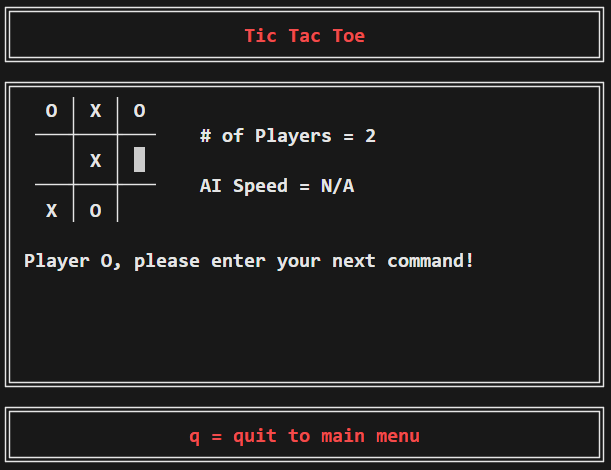
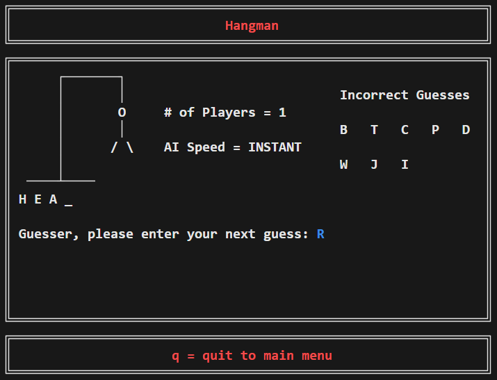
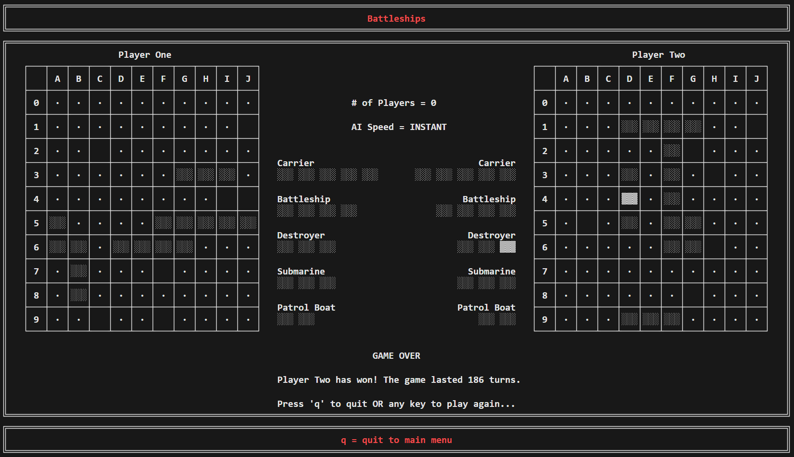

# Terminal Games

Simple games that run in the terminal.

## Getting Started

CMake can be used to build the project:

```cmd
git clone https://github.com/J-Afzal/Terminal-Games.git
cd Terminal-Games
cmake -S . -B ./build -D "CMAKE_BUILD_TYPE=Release"
cmake --build ./build --config Release
```

The executable can be called from the command line:

```cmd
./build/terminal-games
```

Here are the full list of options:

```cmd
Usage: terminal-games [options]

OPTIONS:

Generic Options:

  --h --help        Display available options.

terminal-games options:

  --a --ascii-only  Only use ASCII characters (this removes all colour).
```

## General Information

**Feature:** Pressing the `q` key on most screens within `terminal-games` will quit to the main menu, if within a game, and quit
the program, if within the main menu.



### Tic Tac Toe

**Supports:** 2 players (user vs user), 1 player (user vs computer) and 0 players (computer vs computer).

**Features:** The arrow keys can be used to navigate the board.

**Note:** The computer's choices are random.



### Hangman

**Supports:** 2 players (user vs user), 1 player (user vs computer) and 0 players (computer vs computer).

**Constraints:** The word to be guessed must be 3-14 characters long and can only contain letters. Only a single letter can be
guessed at a time.

**Features:** When guessing, you can use the up/down arrow keys to scroll through the available letters, or press a letter key
to select it (please note that pressing q here will quit to the main menu).

**Note:** The computer's choices are random both when guessing letters and when selecting a word to be guessed from the
`./resources/words.txt` file.



### Battleships

**Supports:** 1 player (user vs computer) and 0 players (computer vs computer).

**Features:** The arrow keys can be used to navigate the board. Selecting ship positions can be done in either an incrementing
or decrementing order with respect to the co-ordinates. Backspace can be used to undo a ship co-ordinate selection for a ship
that has not been completely placed on the board.

**Note:** The computer's choices are random for both selecting where to place ships and where to attack.



## Development Setup

For development a few extra tools are needed.

### Node

Install the Node (>= v22.12.0) dependencies to run the `cspell` and `prettier` linters:

```cmd
npm install
cspell .
prettier . --check
```

### PowerShell

Install PowerShell to run the ScriptAnalyzer and custom scripts:

```ps1
Invoke-ScriptAnalyzer -Path . -Recurse -Severity Information

Import-Module ./scripts/Linters.psm1
Test-GitAttributesFile -Verbose
Test-TerminalGamesCode -Verbose
```

### Clang

Install `clang` and `clang-tidy` (>= version 19.1.6). On windows you can download and run the `LLVM-19.1.6-win64.exe` binary
from the [LLVM release page](https://github.com/llvm/llvm-project/releases/tag/llvmorg-19.1.6).

```cmd
clang-tidy [file] -p ./build
```

Or you can use the custom linter script to run `clang-tidy` against the entire repository:

```ps1
Import-Module ./scripts/Linters.psm1
Test-TerminalGamesCode -Verbose
```

:warning: CMake must be configured using a generator that creates a `compile_commands.json` file in the build directory before running
`clang-tidy` (e.g. `-G "Ninja"`, `-G "NMake Makefiles"`, etc) :warning:

### IDE

On Windows, Visual Studio 2022 can be used by opening the folder as a CMake project and Visual Studio Code can be used by
opening the folder through the `Developer PowerShell for VS` (otherwise you may see errors around cl.exe not being found).

## Releases

[](https://github.com/J-Afzal/Terminal-Games/actions/workflows/continuous_integration.yml)
[](https://github.com/J-Afzal/Terminal-Games/actions/workflows/continuous_deployment.yml)

Releases are performed automatically on pushes to master (i.e. when a pull request is merged) via the continuous deployment
workflow.

<!--
TODO:

Tic Tac Toe
    - Clean up code
        - Remove braces for single line statements
        - Check all NOLINT
        - Collapse to single while loop in ExecuteNextUserCommand
    - New features:
        - Add restart with same settings with game over message update
    - Create test plan and confirm all things work (including other platforms and with ascii only)

Hangman
    - Clean up code
        - Remove braces for single line statements
        - Check all NOLINT
        - Show word to be guessed '_'s on first turn before any user input
        - delete m_errorCount?
    - New features:
        - Add restart with same settings with game over message update
    - Create test plan and confirm all things work (including other platforms and with ascii only)

Battleships
    - Clean up code
        - Remove braces for single line statements
        - Check all NOLINT
    - New features:
        - Add restart with same settings with game over message update
    - Create test plan and confirm all things work (including other platforms and with ascii only)

PageBuilder
    - Clean up GetGameDisplay func (maybe implement grid system?)

Main Menu
    - Clean up code
    - New features:
        - Add homepage with option selection (ascii only and platform label and navigation instruction depending upon platform and press key to go to main menu)
        - Press 'h' to go back to the above page
    - Create test plan and confirm all things work (including other platforms and with ascii only)

Linters
    - gitattributes
        - Flag extra new lines
        - Redundant entries
        - Duplicate entries
    - cspell
        - Redundant entries
        - Duplicate entries
    - file names
        - they are all standardised to any casing (maybe use $fileName = $fileName.ToTitleCase()?)

Doxygen
    Add build to CI with artifact to check.
    Add build and publish to CD and publish to GH pages (maybe commit to repo but make sure no infinite loop)
    Update readme to link to GH pages docs

Test Plans
    Setup MacOS and Ubuntu VMs and see if test plan succeed
    Update readme to reference them and differences between platforms
 -->