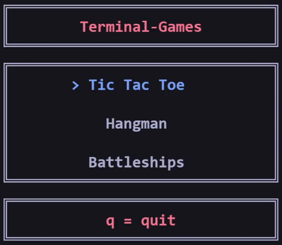
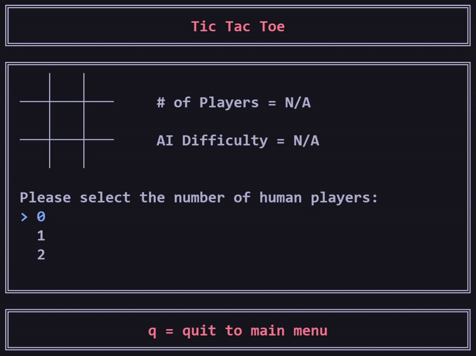
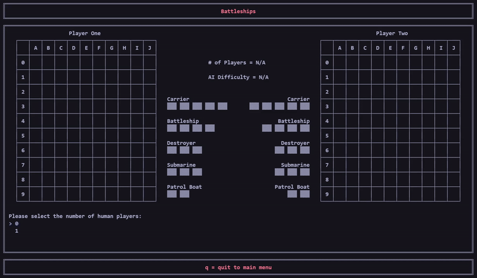
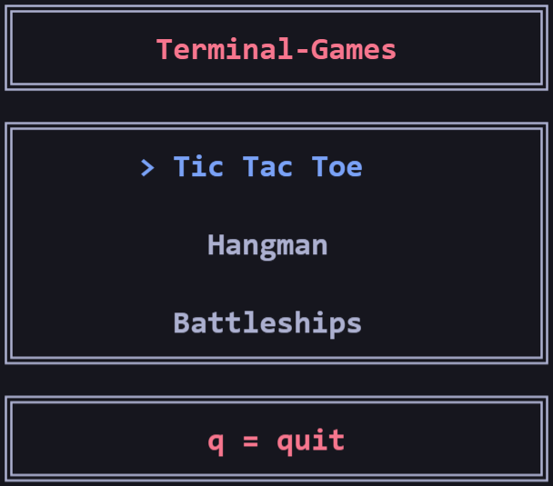
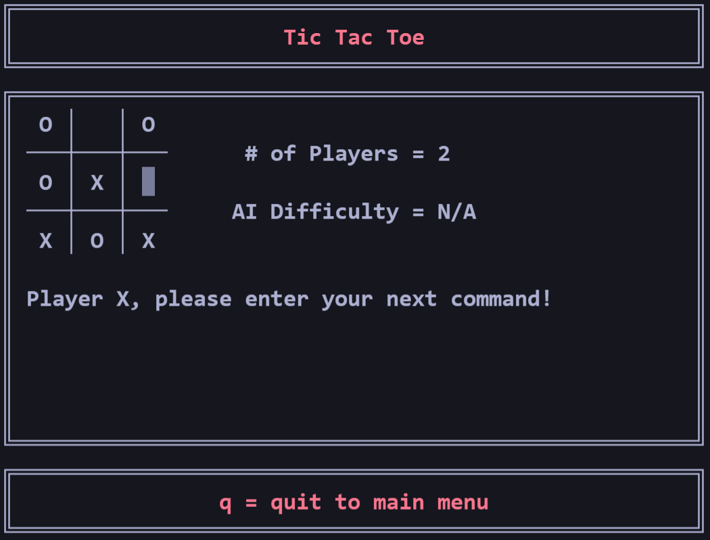
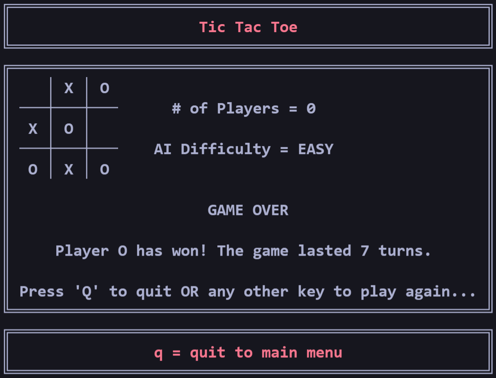
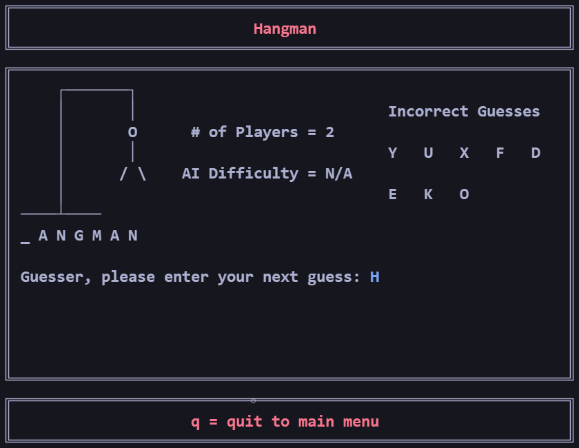
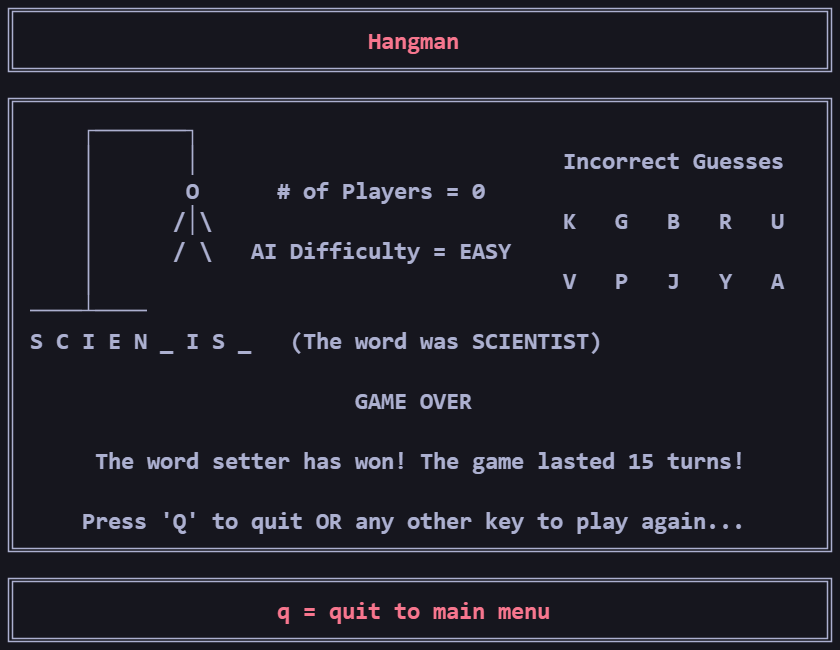
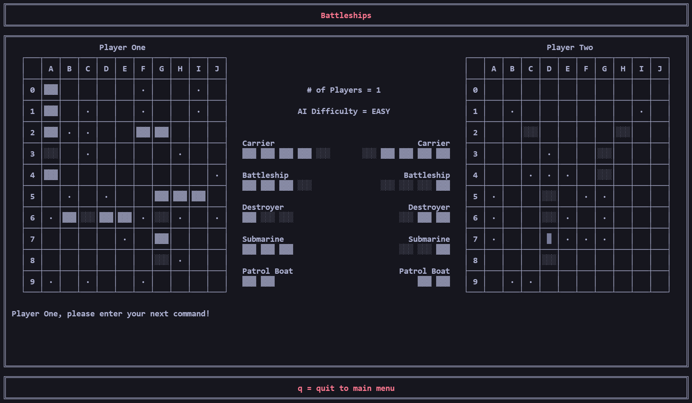
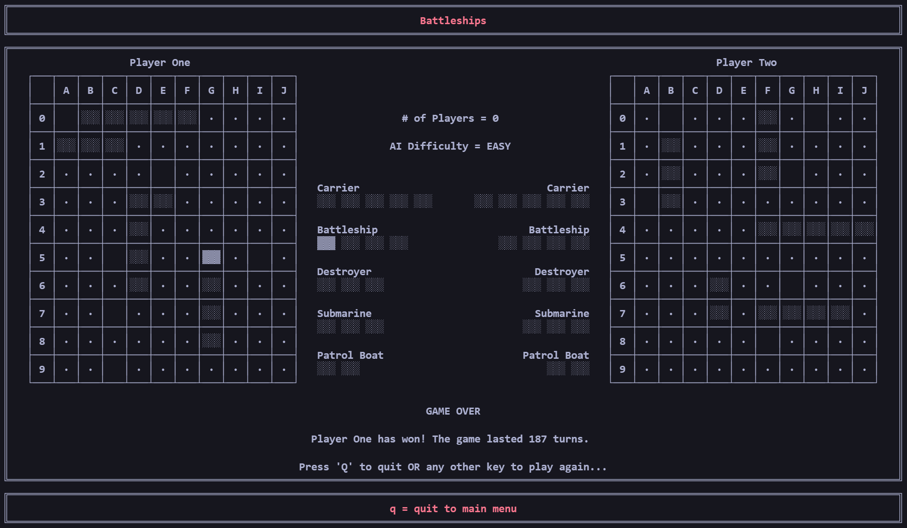

<p align="center">  </p>
<p align="center">   </p>
<p align="center">  </p>

# Screenshots
<p align="center">  </p>
<p align="center">   </p>
<p align="center">   </p>
<p align="center">   </p>

# About
Simple games that run in the terminal
* For all games:
  * 2 players = human vs human, 1 player = human vs computer, and 0 players = computer vs computer
  * Easy AI = random command/letter/move selection by computer
* For Hangman:
  * The word to be guessed must be 3-14 characters long and contain only letters
  * Only single letter guesses allowed
  * When guessing a letter, you can use the arrow keys to scroll through letters or press a letter key to skip to that letter (please note that pressing q here will quit the game)
* For Battleships:
  * Selecting ship positions must be done in either an incrementing or decrementing order with respect to co-ordinates
  * Backspace can be used to undo a ship co-ord selection, but a ship that has been already been placed cannot be undone

# Building [](https://github.com/J-Afzal/Terminal-Games/actions/workflows/cmake.yml)
Use the following CMake command in the project root directory:
```
cmake -S . -B build
```

# Warning
Due to the use of ```_getch()```, ```Windows.h```, and ANSI colour escape codes, this project only works on Windows using either the Visual Studio Terminal or the Visual Studio Code Integrated Powershell Terminal.
