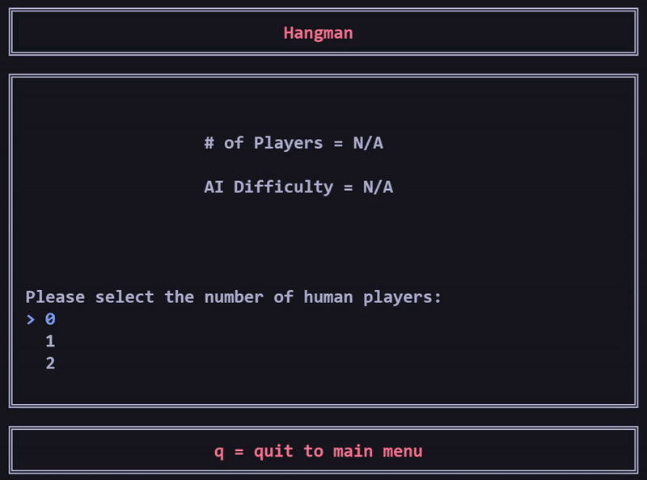

# About
* For all games, 2 players represent human vs human, 1 player represents a human vs computer, and 0 players represent computer vs computer
* For all games, easy AI = random command/letter selection
* For Hangman, the word to be guessed must be 3-14 characters long and contain only letters
* For Hangman, only single letter guesses allowed
* For Hangman, when guessing a letter, instead of scrolling through letters using the arrow keys, pressing a letter key will skip the current selected guess to that letter (Warning: pressing q will quit the game)
* For Battleships, selecting ship positions must be done in either an incrementing or decrementing order
* For Battleships, backspace can be used to undo a ship co-ord selection, but a ship that has been already been placed cannot been undone

# Installing
Use the following command in the project root directory to create a project in the build folder:
```
cmake -S . -B build
```

# Warning
This program was developed and tested on the Visual Studio Terminal and Visual Studio Code Integrated Powershell Terminal on Windows 10. Due to the use of _getch(), Windows.h, and ANSI colour escape codes this program may not work in other terminal environments.

# Game List
<p align="center">
    
</p>

# Tic Tac Toe
<h3 align="center">
  Player vs Computer example
</h3>
<p align="center">
    
</p>
<h3 align="center">
  In Game Screenshot
</h3>
<p align="center">
    
</p>
<h3 align="center">
  Game Over Screenshot
</h3>
<p align="center">
    
</p>

# Hangman
<h3 align="center">
  Player vs Player example
</h3>
<p align="center">
    
</p>
<h3 align="center">
  In Game Screenshot
</h3>
<p align="center">
    
</p>
<h3 align="center">
  Game Over Screenshot
</h3>
<p align="center">
    
</p>

# Battleships
<h3 align="center">
  Player vs Computer example
</h3>
<p align="center">
    
</p>
<h3 align="center">
  In Game Screenshot
</h3>
<p align="center">
    
</p>
<h3 align="center">
  Game Over Screenshot
</h3>
<p align="center">
    
</p>
