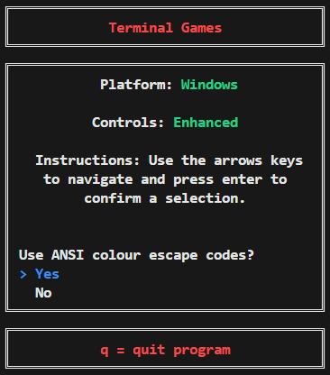
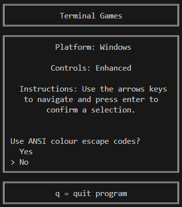
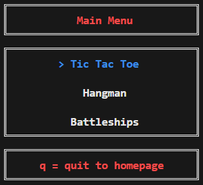
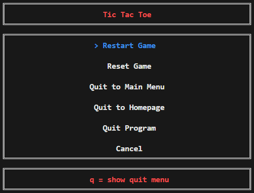
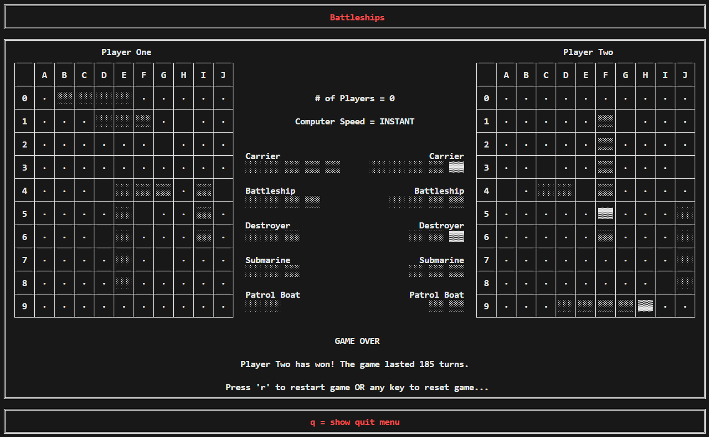

# Terminal Games

Simple games that run in the terminal.

## Getting Started

CMake can be used to build the project:

```cmd
git clone https://github.com/J-Afzal/Terminal-Games.git
cd Terminal-Games
cmake -S . -B ./build -D "CMAKE_BUILD_TYPE=Release"
cmake --build ./build --config Release
```

The executable can be called from the command line:

```cmd
./build/terminal-games
```

Here are the full list of options:

```cmd
Usage: terminal-games [options]

OPTIONS:

Generic Options:

  --h --help        Display available options.

terminal-games options:

  --a --ascii-only  Only use ASCII characters (this removes all colour).
```

## General Information

There is extensive use of ANSI colour escape codes which can be toggled off on the homepage if your terminal does not support
them. All major platforms (macOS, Linux and Windows) are supported however due to the use of `Windows.h` the user experience is
much better on Windows.

### Homepage

**Feature:** Can select whether to use ANSI colour escape codes.





### Main Menu



### Quit Menu

**Feature:** Pressing the `q` key on any game screen will show the quit menu.



### Tic Tac Toe

**Supports:** 2 players (user vs user), 1 player (user vs computer) and 0 players (computer vs computer).

**Features:** The arrow keys on Windows or the `WASD` keys on other platforms can be used to navigate the board.

**Note:** The computer's choices are random.


### Hangman

**Supports:** 2 players (user vs user), 1 player (user vs computer) and 0 players (computer vs computer).

**Constraints:** The word to be guessed must be 3-16 characters long and can only contain letters. Only a single letter can be
guessed at a time.

**Features:** When guessing, you can use the up/down arrow keys on Windows or the `W`/`S` keys on other platforms to scroll
through the available letters, or press a letter key to select it (please note that pressing q here will show the quit menu).

**Note:** The computer's choices are random both when guessing letters and when selecting a word to be guessed from the
`G_HANGMAN_COMPUTER_WORDS` variable in `Globals.hpp`.


### Battleships

**Supports:** 1 player (user vs computer) and 0 players (computer vs computer).

**Features:** The arrow keys on Windows or the `WASD` on other platforms can be used to navigate the board. Selecting ship
positions can be done in either an incrementing or decrementing order with respect to the co-ordinates. Backspace on Windows or
the `Z` key on other platforms can be used to undo a ship co-ordinate selection for a ship that has not been completely placed
on the board.

**Note:** The computer's choices are random for both selecting where to place ships and where to attack.



## CI / CD

[](https://github.com/J-Afzal/Terminal-Games/actions/workflows/ContinuousIntegration.yml)
[](https://github.com/J-Afzal/Terminal-Games/actions/workflows/ContinuousDeployment.yml)

The continuous integration workflow runs against all commits on pull requests, builds the code and runs linting checks.

The continuous deployment workflow runs against all commits to master, builds the code and deploys the executables as a release.

## Development Setup

For development a few extra tools are needed to check for linting issues locally. The `Test-CodeUsingAllLinting` function
can be called to locally run all the linting steps in the CI workflow.

```ps1
Import-Module ./modules/TerminalGames.psd1
Test-CodeUsingAllLinting -Verbose
```

The obvious dependencies are:

- Git
- CMake (>= v3.20)
- C++ compiler of your choice

### PowerShell

Install PowerShell to run the `TerminalGames` module and the ScriptAnalyzer:

```ps1
Import-Module ./modules/TerminalGames.psd1
Test-CodeUsingPSScriptAnalyzer -Verbose
```

### Node

Install the Node (>= v22.12.0) dependencies using `npm install` to run the `cspell` and `prettier` linters:

```ps1
Import-Module ./modules/TerminalGames.psd1
Test-CodeUsingCSpell -Verbose
Test-CodeUsingPrettier -Verbose
```

### Generator

Any generator can be used to build the project but to run `clang-tidy`/`clang-format` CMake must be configured using a generator
that creates a `compile_commands.json` file in the build directory before running `clang-tidy`/`clang-format` (e.g.
`-G "Ninja"`, `-G "NMake Makefiles"`, etc)

### Clang

Install `clang-tidy` and `clang-format` (>= version 19.1.6). On windows you can download and run the `LLVM-19.1.6-win64.exe`
binary from the [LLVM release page](https://github.com/llvm/llvm-project/releases/tag/llvmorg-19.1.6) or use
[chocolatey](https://community.chocolatey.org/packages/llvm).

```cmd
clang-tidy [file] -p ./build
```

```cmd
clang-format --Werror --dry-run [file]
```

The `TerminalGames` module can be used to run `clang-tidy` and `clang-format` against the entire repository (with optional
parameters to fix any fixable errors):

```ps1
Import-Module ./modules/TerminalGames.psd1
Test-CodeUsingClang -FixClangTidyErrors -FixClangFormatErrors -Verbose
```

### IDE

On Windows, Visual Studio 2022 can be used by opening the folder as a CMake project and Visual Studio Code can be used by
opening the folder through the `Developer PowerShell for VS` (otherwise you may see errors around cl.exe not being found).
